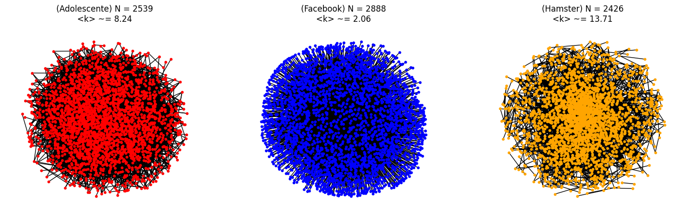
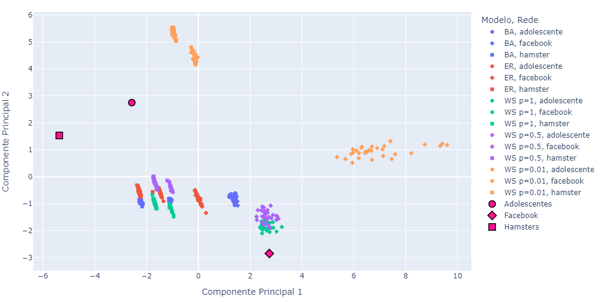
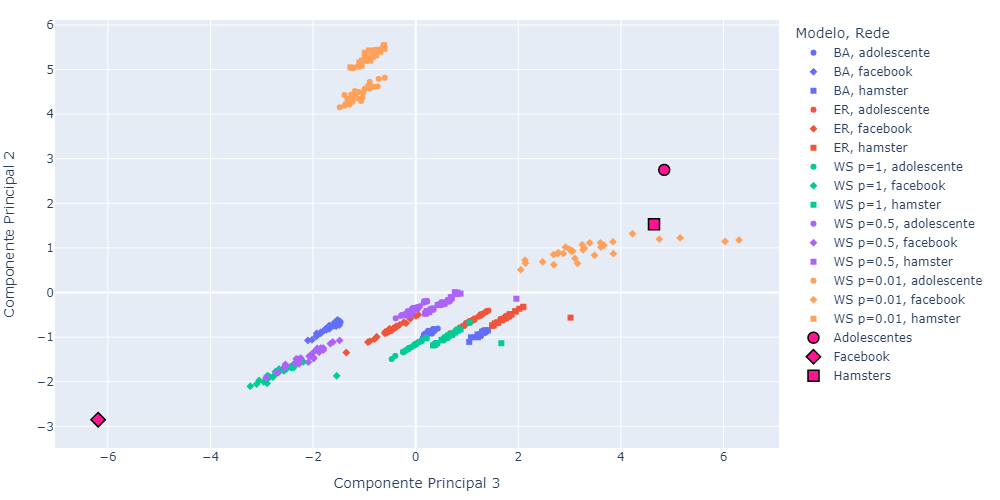
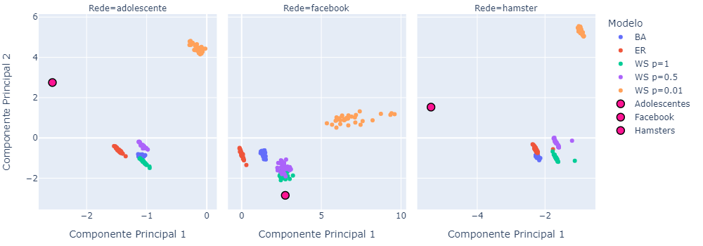
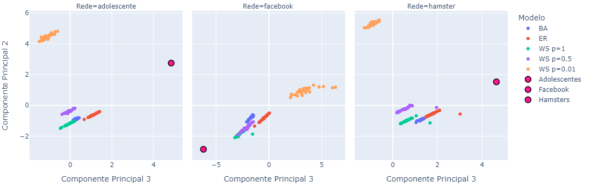

# Trabalho de Redes Complexas
A proposta do trabalho é verificar qual é o modelo mais adequado para descrever redes sociais, com base em medidas de grafos.
No caso, utilizamos as seguintes redes sociais como base:

1. Facebook (NIPS): [http://konect.cc/networks/ego-facebook/](http://konect.cc/networks/ego-facebook/)
2. Hamsterster full: [http://konect.cc/networks/petster-hamster/](http://konect.cc/networks/petster-hamster/)
3. Adolescent health: [http://konect.cc/networks/moreno_health/](http://konect.cc/networks/moreno_health/)

Para visualizarmos as redes, utilizamos o módulo [networkx](https://networkx.org/documentation/stable/index.html) e o gráfico gerado pode ser visto abaixo:

Então, depois de carregarmos as redes, devíamos utilizar o mesmo número de vértices e o grau médio para simular um grafo; os modelos matemáticos que consideramos foram os seguintes:

- _Barabási-Albert_; 
- _Erdős–Rényi_; e
- _Watts-Strogatz_ com probabilidades de reconexão iguais à 1.0, 0.5 e 0.01.

Assim, para cada uns dos grafos simulados (foram 30 repetições para cada rede social e cada modelo proposto, totalizando 450 simulações), escolhemos as seguintes medidas para serem calculadas e utilizadas como variáveis de classificação:

1. Grau Médio
2. Assortatividade
3. Coeficiente de Clusterização
4. Transitividade
5. Entropia de Shannon
6. Média dos Menores Caminhos
7. Média da Intermediação
8. Ponto Central de dominância
9. Diâmetro
10. Métrica S
11. Quantidade de Baricentros
12. Excentricidade Média
13. $\rho$(Grau do Nó, Grau Médio dos Vizinhos)
14. $\rho$(Grau do Nó, Centralidade de Proximidade)
15. $\rho$(Grau do Nó, Cliques do Nó)

Essencialmente, estes comentários concluem a parte de simulação; os códigos estão nos arquivos `CONSTANTES.py` e `simulacao.py`.
Um detalhe que nos orgulhamos de termos implementado é a simulação em paralelo: a função `simulacao_e_medidas` gera um grafo de um modelo específico e calcula as 15 medidas, não havendo dependência de variáveis externas, dessa forma, conseguimos organizar o código de forma a gerar 5 grafos por "iteração", reduzindo o tempo de execução das 450 simulações de quase 10 horas para apenas 2,5 horas, o que, considerando a quantidade de medidas e os tamanhos das redes originais, julgamos que é uma grande melhora de performance.

Continuando, pudemos começar a modelagem com as simulações feitas. Só antes, precisavamos visualizar graficamente a "distribuição" das simulações e das redes sociais em um plano 2D, para isso, aplicamos uma análise de componentes principais com 3 componentes, o que totaliza aproximadamente 82.41% da variabilidade das medidas. Os gráficos que conseguimos obter estão representados abaixo:

E finalmente, começamos a modelagem de redes para descobrir é o modelo mais adequado. Os algoritmos/funções/métodos de classificação supervisionados considerados foram os seguintes:

1. _SVM_ com núcleos linear, radial e polinomial de grau 3;
2. _Stochastic gradient descent_;
3. K-Vizinhos mais próximos considerado 3, 5 e 7 vizinhos;
4. _Naive-Bayes_, assumindo normalidade;
5. Árvore de decisão;
6. Floresta aleatória, com 500 árvores; e
7. _AdaBoosting_, com 500 estimadores.

Usando as três componentes principais como variáveis de treino e validação cruzada com 10 _folds_, os três melhores modelos foram a árvore de decisão, "3-vizinhos mais próximos" e a floresta aleatória. Então retreinamos estes modelos com todas as simulações e partimos para a classificação das redes sociais.

Infelizmente, acreditamos que os resultados obtidos não são muito confiáveis, mas concluímos que o modelo _Watts-Strogatz_ é o mais adequado para redes sociais, sendo necessário investigar a fundo qual o melhor valor para a probabilidade de reconexão.